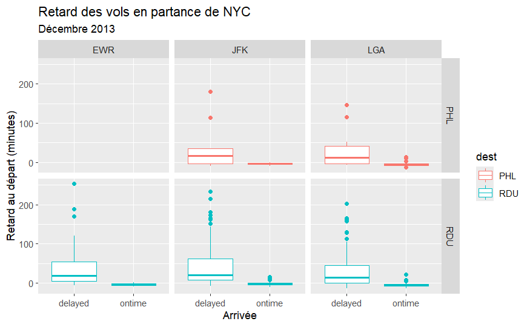

# EXAMEN 1

## Consignes

1.  Vos solutions doivent être rédigées dans le fichier R Markdown (Rmd) appelé exam-01.Rmd. Ce fichier doit inclure votre code et votre rédaction pour chaque question. Votre “soumission” sera ce qui se trouve dans votre dépôt d’examen à la date limite. Commitez et poussez les fichiers Rmd et md produits.

2.  Cet examen est à livre ouvert, internet ouvert, autres personnes fermées. Vous pouvez utiliser toutes les ressources en ligne ou basées sur des livres que vous souhaitez, mais vous devez inclure des citations pour tout code que vous utilisez (directement ou indirectement). Vous ne pouvez pas consulter quelqu’un d’autre à propos de cet examen à part les encadrants du cours. Vous ne pouvez pas poser de questions directes sur internet. Vous pouvez guider vos camarades vers les bonnes ressources, mais ne pas leur donner de réponses directes.

3.  Vous avez jusqu’au **28.10.2024** pour compléter cet examen et le rendre via votre dépôt personnel Github - les travaux en retard seront pénalisés. Les difficultés techniques ne sont pas une excuse pour les travaux en retard - n'attendez pas la dernière minute pour knitt / commit / push.

4.  Chaque question nécessite une (brève) narration ainsi qu’une (brève) description de votre approche. Vous pouvez utiliser des commentaires dans votre code, mais ne comptez pas exclusivement sur ceux-ci. Nous devrions pouvoir supprimer tout le code dans votre document et toujours pouvoir lire et comprendre vos réponses. Utilisez le texte entre les blocs de code pour cela.

5.  Même si la réponse semble évidente à partir de la sortie R, assurez-vous de l’énoncer également dans votre narration. Par exemple, si la question demande ce que fait 2 + 2, et que vous avez ce qui suit dans votre document, vous devriez également avoir une phrase qui dit “2 + 2 fait 4.”

``` r
2 + 2
# 4
```

6. Vous ne pouvez utiliser que `tidyverse` et `nycflights13` (et ses dépendances) pour cet exercice. Vos solutions ne peuvent utiliser aucun autre package R.

## Déclaration d’intégrité académique

*JE, [VOTRE NOM], déclare que l'ensemble du travail produit est le mien et qu'il n'a pas été produit par une autre personne ou un logiciel.*

**Note sur la réutilisation de code:** Je suis bien conscient qu'un grand volume de code est disponible sur le web pour résoudre un certain nombre de problèmes. Pour cet examen, vous êtes autorisé à utiliser toutes les ressources en ligne (par exemple, StackOverflow), mais vous devez citer explicitement l'endroit où vous avez obtenu tout code que vous utilisez directement (ou utilisez comme inspiration). Vous n'êtes pas autorisé à poser une question sur un forum externe, vous ne pouvez utiliser que des réponses à des questions qui ont déjà été posées. Tout code recyclé qui est découvert et n'est pas explicitement cité sera traité comme du plagiat. Les communications avec des camarades de classe doit se limiter à résoudre des problèmes élémentaires: il n'est pas autoriser de reprendre le travail d'un camarade. L'utilisation d'IA générative n'est pas autorisée.

## Obtenir de l’aide
Vous pouvez poser des simples questions à vos camarades de classe, mais vous ne pouvez pas partager de code. Vous ne pouvez pas poser de questions sur Internet. Si vous avez des questions sur l’examen, vous pouvez également les poser au personnel encadrant.

## Évaluation
Le total des points pour les questions s’élève à 90 points. Les 10 points restants sont attribués au style de code, à la fréquence et aux messages de commit, à l’organisation générale, à l’orthographe, à la grammaire, etc. Il y a également une question bonus qui vaut 5 points.

## Logistique
Répondez aux questions dans le document appelé exam-01.Rmd. Ajoutez votre code et votre narration dans les espaces sous chaque question. Ajoutez des blocs de code au besoin. Utilisez autant de lignes que nécessaire, mais gardez votre narration concise. Avant de terminer, assurez-vous de supprimer le code non nécessaire et de relire vos réponses une fois de plus. Assurez vous de ce qui est présent sur votre repository github avant la date limite.

## Packages
En plus de `tidyverse`, vous aurez besoin du package `nycflights13` pour les données. Vous devrez d’abord installer ces packages avant de les charger.

## Les données
Le package `nycflights13` contient des informations sur tous les vols qui ont quitté New York City (les aéroport, EWR, JFK et LGA) en 2013. Les données principales se trouvent dans le dataframe `flights`, mais il y a des données supplémentaires qui peuvent aider à comprendre ce qui cause les retards, notamment :

- `weather` : données météorologiques horaires pour chaque aéroport
- `planes` : informations de construction sur chaque avion
- `airports` : noms et emplacements des aéroports
- `airlines` : traduction entre les codes de transporteur à deux lettres et les noms

## Questions

1.  **Question 1 (5 points)** - Quelles sont les dix destinations les plus courantes pour les vols au départ des aéroports de NYC en 2013?
    Faites un tableau qui les liste par ordre décroissant de fréquence et montre le nombre de vols à destination de chaque aéroport.
    
2.  **Question 2 (5 points)** - Quelles compagnies aériennes ont le plus de vols au départ des aéroports de NYC en 2013?
    Faites un tableau qui les liste par ordre décroissant de fréquence et montre le nombre de vols pour chaque compagnie aérienne.
    Dans votre narration, mentionnez également les noms des compagnies aériennes.
    *Indice:* Vous pouvez utiliser le dataframe `airlines` pour rechercher le nom de la compagnie aérienne en fonction du code `carrier`.
    
3.  **Question 3 (10 points)** - Considérez uniquement les vols qui ont des informations de retard d’arrivée non manquantes.
    Votre réponse doit inclure le code de la compagnie arérienne et les valeurs demandées. Utilisez le dataframe `airlines` pour retrouver le nom des compagnies associées à chaque code.

    a\.
    Quelle compagnie aérienne a eu le retard moyen d'arrivée le plus élevé?
    
    b\.
    Quelle compagnie aérienne a eu le retard moyen d’arrivée le plus bas ?
    
4.  **Question 4 (10 points)** - Quelle était la température moyenne à l’aéroport d’origine le jour du retard de départ le plus élevé ? 
Votre réponse doit inclure le nom de l’aéroport d’origine, la date du retard de départ le plus élevé et la température moyenne **en degrés celsius** ce jour-là.
*Indice:* Il faudra peut-être le faire en deux fois: commencez par trouver l'aéroport de départ et le jour où le retard au départ est le plus élevé, puis calculez la température moyenne pour ce lieu et ce jour là.

5.  **Question 5 (15 points)** - Considérez la journée divisée en quatre intervalles de temps : 00h01-06h00, 06h01-12h00, 12h01-18h00, 18h01-00h00. 

    a\.
    Calculez la proportion de vols retardés au départ pour chacun de ces intervalles de temps.
    
    b\.
    Commentez comment la probabilité d’être retardé change au cours de la journée.
    
    *Hint*: Créez une nouvelle variable qui indique "nuit", "matin", "après-midi" ou "soir" selon l'intervalle de la journée.
    
    *Hint*: Pour calculer la proportion de vols retardés dans chaque intervalle, vous pouvez le faire en deux fois: une première en comptant le nombre de vol dans chaque intervalle, pui le nombre de vol retardés dans chaque intervalle. La proportion peut être indiquée dans la narration. Si vous voulez le faire en une fois, créez une variable `retard` qui indique 1 si le vol est retardé et 0 sinon. Vous pourrez ensuite faire la somme de cette variable pour chaque intervalle de temps pour connaitre le nombre de vol retardé, que vous pourrez diviser par le nombre total de vol dans chaque intervalle.

6.  **Question 6 (15 points)** - Trouvez le vol avec le temps de vol le plus long. 

    a\.
    Quelle est la durée de ce vol ? 
    
    b\.
    Quelle ville a-t-il desservie ? 
    
    c\. 
    Combien de sièges l’avion qui a effectué ce vol possède-t-il ?

7.  **Question 7 (15 points)** - Le dataframe `airports` contient des informations sur un grand nombre d’aéroports principalement américains. Ces données incluent des informations de localisation pour ces aéroports sous forme de coordonnées de latitude et de longitude. Dans cette question, nous limitons notre analyse aux [frontières contigues des États-Unis](https://en.wikipedia.org/wiki/Contiguous_United_States). Visualisez et décrivez la distribution des longitudes des aéroports dans les frontières contigues des États-Unis. Que cela vous apprend-t-il sur la distribution géographique de ces aéroports ?

Visualisez sous forme de *scatterplot* la latitude et la longitude des aéroports dans les frontières contigues des États-Unis. Qu'observez-vous ?

Indice : Vous devrez d’abord limiter votre analyse aux frontières contigues des États-Unis. [Cet article](https://en.wikipedia.org/wiki/List_of_extreme_points_of_the_United_States) peut vous aider, mais vous êtes également invités à utiliser d’autres ressources. Assurez-vous de citer toutes les ressources que vous utilisez.

8.  **Question 8 (15 points)** - Recréez le graphique ci-dessous en utilisant les données flights. Une fois que vous avez créé la visualisation, décrivez en un paragraphe ce que vous pensez être le point de cette visualisation. Indice : La visualisation utilise la variable `arrival`, qui n’est pas incluse dans le dataframe `flights`. Vous devrez créer `arrival` vous-même, c’est une variable catégorielle qui est égale à "ontime" lorsque `arr_delay <= 0` et "delayed" lorsque `arr_delay > 0`.



Bonus (5 points) - Créez une visualisation qui montre efficacement s’il existe une relation entre le retard moyen de départ quotidien et la température moyenne quotidienne pour les trois aéroports de New York. (Vous ne devriez consacrer du temps à cette question qu’une fois que vous avez terminé de répondre aux autres)

*Hint:* Vous pouvez utiliser la fonction `left_join` pour joindre deux dataframe selon une ou plusieurs colonnes communes. Cela vous permettra d'obtenir un tableau avec les données des vols et de la météo.

*Attention:* Cette question vous demandera d'utiliser une fonction que nous n'avons pas encore vue en cours ! La lecture de la documentation est donc importante.


